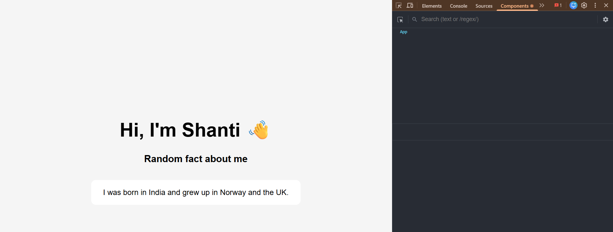

# Introduction App

This is a small React + TypeScript application created for Interactive Frontend Work Requirement 1.

The app displays my name and shows random fun facts about me. A new random fact is displayed automatically every 2 seconds.

## How to run the app

1. Clone the repository.
2. Open the project folder in Visual Studio Code.
3. Install the dependencies:

```bash
npm install
```

4. Start the development server:

```bash
npm run dev
```

5. Open the localhost link shown in the terminal.

## Tools used

- React
- TypeScript
- Vite
- Visual Studio Code
- React DevTools
- Git
- GitHub

## React DevTools

The screenshot below shows the application being inspected using React DevTools.

